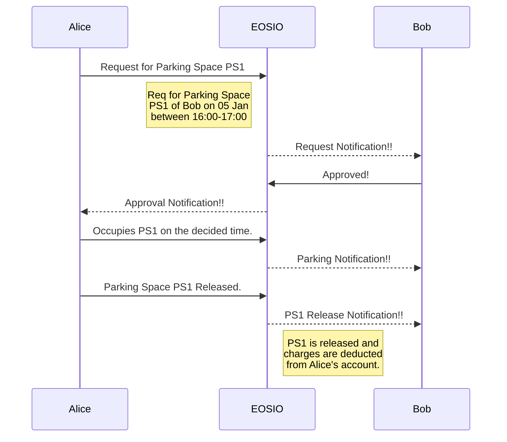

# ParkAssist

A blockchain based parking space sharing app. 

 - Based on EOSIO, eosjs and react
 - Used by parking provider and driver to share parking spaces
 - No intermediaries or central authority/broker

## Get Started
coming soon

## Flow

Parkassist Flow diagrams using [Mermaid](https://mermaidjs.github.io/). 

