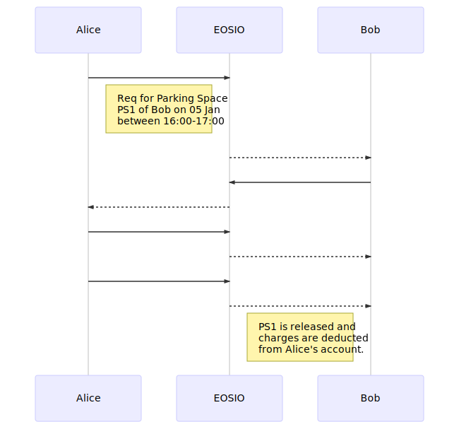

# ParkAssist

A blockchain based parking space sharing app. 

 - Based on EOSIO, eosjs, react and ipfs
 - Used by parking provider and driver to share parking spaces
 - No intermediaries or central authority/broker

## Get Started
###Components
- [EOS blockchain framework](https://developers.eos.io/) - EOS claims to be highly scalable and performant framework with transaction rate of 1000 txn per sec. Also there are no transaction charges.
- [eosjs](https://github.com/EOSIO/eosjs) - A Javascript library for EOS blockchain API integration
- [IPFS](https://ipfs.io/) - A protocol and network for storing and sharing of hypermedia on a p2p network.
- [ReactJs](https://reactjs.org/)

###Setup
1. Deploy EOSIO blockchain locally or use [jungle testnet](https://api.jungle.alohaeos.com:443) 
2. Create the accounts and contracts in blockchain. Also deploy the contracts.
3. We are using user accounts directly in the app but Scatter can also be used as browser based wallet. **DON'T USE THIS IN PRODUCTION**.
4. Deploy IPFS on a node and save the Parking space table in the below format
    *{
      "ParkingSpaces": [
        {
          "owner": "amitinjungle",
          "name": "Amit Kumar",
          "psname": "Krishna Bakery, MG Rd"
        },
        {
          "owner": "harryinjungl",
          "name": "Harry Potter",
          "psname": "590 N Mathilda Ave"
        },
        {
          "owner": "jackinjungle",
          "name": "Jack Nicholsen",
          "psname": "Sign Towers, SouthCity"
        }
      ]
    }*
5. Configure the app settings with EOSIO endpoint, EOS accounts and IPFS endpoint; and start the app.

## Flow

